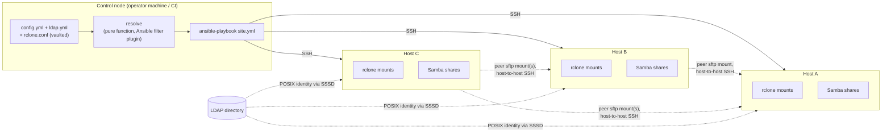

# stortree

Declarative storage-tree management for a small fleet of Linux hosts:
one config describes a directory tree, and an Ansible playbook turns it
into [rclone](https://rclone.org/) mounts, [Samba](https://www.samba.org/)
shares access-controlled by real Unix ownership and mode, and Unix
identity resolved from your existing LDAP directory — kept in sync
across every host that participates. There's no daemon and no custom
CLI: a control node (an operator's machine or CI) runs `ansible-playbook`
against the fleet over plain SSH, the same way you'd run any other
Ansible project.

> **Status: running in production against a real fleet; the Molecule
> harness has never been run.** A good deal of the design below is scar
> tissue from live applies — the `PartOf=` on nested mounts, the
> presentation mounts for granted nodes, the non-fatal directory
> creation, and
> the unknown-key rejection each exist because the obvious version broke
> on real hosts; those incidents are recorded at their point of
> implementation. What that leaves untested is the *clean-slate* path:
> nothing has ever applied these roles to a host that didn't already have
> them, which is exactly what the Docker-based scenario in
> `molecule/full-tree/` would cover. See
> [docs/plan.md](docs/plan.md) "What's verified" for the precise line
> between the two, and [docs/spec.md](docs/spec.md) for the full design.

## Why

Once storage spans more than one box — a primary server plus a couple of
smaller hosts each backing a share or two — keeping rclone mounts, Samba
config, and ACLs consistent by hand across all of them gets tedious and
error-prone. `stortree` lets one tree, resolved from a single config, drive
every host from a control node that applies each host only the slice it
needs.

## What it does

- **One declarative tree** (`config.yml`) describes every host, client
  mount, subdirectory, and access rule — see
  [docs/config-schema.md](docs/config-schema.md).
- **rclone mounts**, generated as systemd units, either as a host's own
  client mount or as the local storage backing a Samba share.
- **Samba shares** access-controlled by the same Unix ownership/mode the
  playbook sets on the underlying path or rclone mount — one enforcement
  mechanism, reachable identically over Samba or SSH, not a separate ACL
  system that can drift from either.
- **LDAP-backed identity** via SSSD, so a group resolves to the same
  Unix GID on every host, plus `pam_smbpass` to keep Samba's NT-hash
  password store in sync with your directory.
- **Scoped secrets** — every host receives only the `rclone.conf`
  sections its own resolved role actually needs, rendered from an
  `ansible-vault`-encrypted master copy that never leaves the control
  node.
- **Every participating host shares everything** — every host in the
  fleet, including one with no subtree of its own and no mention in
  `config.yml` at all, exposes a Samba share for every directory in the
  tree that carries a `samba:` config. There's no "designated Samba
  host," and a host doesn't need to be named in `config.yml` to join in
  — see [docs/config-schema.md](docs/config-schema.md).
- **Optional Prometheus metrics**, off by default: each rclone mount
  publishes its own endpoint (one process, one mount — no separate
  rclone or manager can adopt mounts it didn't start), with ports
  derived per node so an unrelated config edit never renumbers and
  remounts the rest. Enable it fleet-wide or per host from inventory,
  and `playbooks/metrics-targets.yml` collects every host's endpoints
  into one `file_sd` list — see
  [docs/runbook.md](docs/runbook.md) "Publishing rclone metrics".
- **Automatic peer routing** — a host that needs data owned by another
  host in the tree — most often to assemble a complete Samba share it
  doesn't itself own, per the point above — gets SSH trust to that owning
  host provisioned automatically and sources the data peer-to-peer,
  instead of re-mounting the original remote a second time with a second
  set of credentials.

## How it works, briefly



No host is special at runtime — the control node applies the same roles
to every host, and any host can serve subtrees, mount as a client, and
authenticate against LDAP. Samba sharing in particular is universal:
every participating host — including one that owns no subtree of its own
and one with no mention in `config.yml` at all, present only in the
Ansible inventory — exposes every `samba:`-configured directory as a
share, peer-sourcing whatever data it doesn't already own. There's no
"root host" holding elevated privileges over its peers, and no
"designated Samba host" either.

Only the control node holds the master config. `ansible-playbook
site.yml` resolves the whole tree and applies every host's slice of it
directly over SSH — no manifest push/pull step, since Ansible already
models "act on every host from one place." Re-running it converges to the
same end state rather than accumulating drift, the same guarantee a
hand-rolled `apply`/`reconcile` split would otherwise exist to provide.

Full details — config resolution, secrets scoping, the Samba/access
layer, SSSD/LDAP identity, `pam_smbpass`, peer trust provisioning, the
role/playbook layout, and the Molecule test harness — are in
[docs/spec.md](docs/spec.md).

## Requirements

**Managed hosts must be Debian-based.** The roles install packages with
`ansible.builtin.apt`, use Debian's package names directly
(`samba-common-bin`, `libpam-modules`), and call `pam-auth-update` — so
any apt/dpkg distro works, and a non-apt host fails on the first task of
`stortree_mounts`. Debian and Ubuntu are what the roles declare in
`meta/main.yml` and the only ones actually applied to; other derivatives
should work but haven't been tried. Nothing else in the design is
distro-specific — rclone, Samba and SSSD are configured through their own
files, not through anything Debian-shaped — so porting elsewhere means
replacing the five `apt` tasks, the package names, and the
`pam-auth-update` call, not reworking the roles.

On the control node: `ansible` plus the `ansible.posix`,
`community.crypto` and `community.general` collections (see
`requirements.txt`/`requirements.yml`).
On every managed host: existing, well-known Linux storage/identity
tooling that the roles configure rather than reinvent — `rclone`, `samba`,
`sssd`, and `samba-common-bin`/`libpam-modules`. See
[docs/spec.md §9](docs/spec.md) for the full dependency list and
test-harness design.

rclone is the one of those worth a decision rather than a default.
Debian ships 1.60.1 in bookworm *and* trixie, and Ubuntu in noble — no
deployable release has the 1.68 `--metrics-addr` flag, so metrics on an
apt host must go out over the rc API, which also serves this host's
backend credentials. `stortree_rclone_install: upstream` installs a
pinned, checksum-verified build from upstream instead, at
`/usr/local/bin/rclone`, and takes over patching it in exchange. The
trade-off and the rollout are in
[docs/runbook.md](docs/runbook.md#upgrading-rclone); the default stays
`apt`.

## Setup

Real config (`inventory/hosts.yml`, `stortree/config.yml`,
`stortree/ldap.yml`, `stortree/rclone.conf`) is never committed here —
copy the `*.example` files, edit them for your fleet, and vault-encrypt
the two that hold credentials:

```
cp inventory/hosts.yml.example inventory/hosts.yml
cp stortree/config.yml.example stortree/config.yml
cp stortree/ldap.yml.example stortree/ldap.yml
cp stortree/rclone.conf.example stortree/rclone.conf
ansible-vault encrypt stortree/ldap.yml stortree/rclone.conf
```

Operator settings that aren't part of the tree — Samba globals, whether
hosts publish metrics — go in ordinary Ansible inventory files, also
uncommitted:
`inventory/group_vars/all.yml.example` for the fleet and
`inventory/host_vars/<host>.yml.example` for one host.

Then `python3 -m venv .venv && .venv/bin/pip install -r requirements.txt
&& .venv/bin/ansible-galaxy collection install -r requirements.yml`. See
[docs/runbook.md](docs/runbook.md) for day-to-day operator commands.

## Tests

Everything except the Molecule scenario runs in seconds on a checkout,
with no Docker and no hosts to talk to:

```
pytest                       # resolution, filters, and rendered templates
pytest --cov                 # ... with the coverage floor enforced
yamllint --strict .          # YAML style
ansible-lint                 # role/playbook lint (skips justified in .ansible-lint)
ansible-playbook playbooks/site.yml --syntax-check
```

`pytest` covers three layers: the pure resolution functions in
`filter_plugins/stortree.py`, the `FilterModule` mapping that exposes
them to plays, and the roles' Jinja templates, rendered through
ansible-core's own filters against real `resolve()` output so a systemd
unit or `smb.conf` can be asserted on without a host to apply it to.

The multi-host Molecule scenario is the exception — it needs privileged
systemd-in-Docker containers and has never been run. Run it locally with
`cd molecule/full-tree && molecule test`. See
[docs/plan.md](docs/plan.md) "What's verified".

GitHub Actions workflows for all of the above (`ci.yml` on every push,
`molecule.yml` on manual dispatch) are written but not yet on `master` —
they live on the `github-workflows` branch. Until that's merged, the
commands above are run by hand.

## Docs

- [docs/spec.md](docs/spec.md) — the specification: architecture,
  role/playbook layout, and the Molecule-based test harness design.
- [docs/config-schema.md](docs/config-schema.md) — full schema reference
  for `config.yml`, `ldap.yml`, and `rclone.conf`, including how the
  three derived name schemes work ("Names and identity").
- [docs/plan.md](docs/plan.md) — how it was built, the interpretation
  calls made along the way, and what is and isn't verified.
- [docs/runbook.md](docs/runbook.md) — operator commands.

## Status

All roles and both playbooks are implemented and applied to a real
fleet. The gap is the clean-slate path: `molecule test` has never been
run in any scenario, so nothing has verified a first apply against a
host that didn't already have these roles on it — see
[docs/plan.md](docs/plan.md) "What's verified" for exactly which checks
back which claim. Contributions and design feedback are welcome via
issues.

## License

GNU General Public License v3.0 — see [LICENSE](LICENSE).
