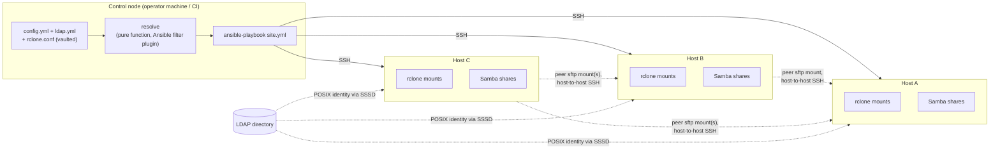

# stortree

Declarative storage-tree management for a small fleet of Linux hosts:
one config describes a directory tree, and an Ansible playbook turns it
into [rclone](https://rclone.org/) mounts, [Samba](https://www.samba.org/)
shares access-controlled by real Unix ownership and mode, and Unix
identity resolved from your existing LDAP directory — kept in sync
across every host that participates. There's no daemon and no custom
CLI: a control node (an operator's machine or CI) runs `ansible-playbook`
against the fleet over plain SSH, the same way you'd run any other
Ansible project.

> 🚧 **Implemented, not yet run against real hosts.** All roles and both
> playbooks exist; the Docker-based test harness is scaffolded but hasn't
> been executed here. See [docs/plan.md](docs/plan.md) for current status
> and [docs/spec.md](docs/spec.md) for the full design.

## Why

Once storage spans more than one box — a primary server plus a couple of
smaller hosts each backing a share or two — keeping rclone mounts, Samba
config, and ACLs consistent by hand across all of them gets tedious and
error-prone. `stortree` lets one tree, resolved from a single config, drive
every host from a control node that applies each host only the slice it
needs.

## What it does

- **One declarative tree** (`config.yml`) describes every host, client
  mount, subdirectory, and access rule — see
  [docs/config-schema.md](docs/config-schema.md).
- **rclone mounts**, generated as systemd units, either as a host's own
  client mount or as the local storage backing a Samba share.
- **Samba shares** access-controlled by the same Unix ownership/mode the
  playbook sets on the underlying path or rclone mount — one enforcement
  mechanism, reachable identically over Samba or SSH, not a separate ACL
  system that can drift from either.
- **LDAP-backed identity** via SSSD, so a group resolves to the same
  Unix GID on every host, plus `pam_smbpass` to keep Samba's NT-hash
  password store in sync with your directory.
- **Scoped secrets** — every host receives only the `rclone.conf`
  sections its own resolved role actually needs, rendered from an
  `ansible-vault`-encrypted master copy that never leaves the control
  node.
- **Every participating host shares everything** — every host in the
  fleet, including one with no subtree of its own and no mention in
  `config.yml` at all, exposes a Samba share for every directory in the
  tree that carries a `samba:` config. There's no "designated Samba
  host," and a host doesn't need to be named in `config.yml` to join in
  — see [docs/config-schema.md](docs/config-schema.md).
- **Automatic peer routing** — a host that needs data owned by another
  host in the tree — most often to assemble a complete Samba share it
  doesn't itself own, per the point above — gets SSH trust to that owning
  host provisioned automatically and sources the data peer-to-peer,
  instead of re-mounting the original remote a second time with a second
  set of credentials.

## How it works, briefly



No host is special at runtime — the control node applies the same roles
to every host, and any host can serve subtrees, mount as a client, and
authenticate against LDAP. Samba sharing in particular is universal:
every participating host — including one that owns no subtree of its own
and one with no mention in `config.yml` at all, present only in the
Ansible inventory — exposes every `samba:`-configured directory as a
share, peer-sourcing whatever data it doesn't already own. There's no
"root host" holding elevated privileges over its peers, and no
"designated Samba host" either.

Only the control node holds the master config. `ansible-playbook
site.yml` resolves the whole tree and applies every host's slice of it
directly over SSH — no manifest push/pull step, since Ansible already
models "act on every host from one place." Re-running it converges to the
same end state rather than accumulating drift, the same guarantee a
hand-rolled `apply`/`reconcile` split would otherwise exist to provide.

Full details — config resolution, secrets scoping, the Samba/access
layer, SSSD/LDAP identity, `pam_smbpass`, peer trust provisioning, the
role/playbook layout, and the Molecule test harness — are in
[docs/spec.md](docs/spec.md).

## Requirements

On the control node: `ansible` plus the `ansible.posix` and
`community.crypto` collections (see `requirements.txt`/`requirements.yml`).
On every managed host: existing, well-known Linux storage/identity
tooling that the roles configure rather than reinvent — `rclone`, `samba`,
`sssd`, and `samba-common-bin`/`libpam-modules`. See
[docs/spec.md §9](docs/spec.md) for the full dependency list and
test-harness design.

## Setup

Real config (`inventory/hosts.yml`, `stortree/config.yml`,
`stortree/ldap.yml`, `stortree/rclone.conf`) is never committed here —
copy the `*.example` files, edit them for your fleet, and vault-encrypt
the two that hold credentials:

```
cp inventory/hosts.yml.example inventory/hosts.yml
cp stortree/config.yml.example stortree/config.yml
cp stortree/ldap.yml.example stortree/ldap.yml
cp stortree/rclone.conf.example stortree/rclone.conf
ansible-vault encrypt stortree/ldap.yml stortree/rclone.conf
```

Then `python3 -m venv .venv && .venv/bin/pip install -r requirements.txt
&& .venv/bin/ansible-galaxy collection install -r requirements.yml`. See
[docs/runbook.md](docs/runbook.md) for day-to-day operator commands.

## Docs

- [docs/spec.md](docs/spec.md) — architecture, role/playbook layout, and
  the Molecule-based test harness design.
- [docs/config-schema.md](docs/config-schema.md) — full schema reference
  for `config.yml`, `ldap.yml`, and `rclone.conf`.
- [docs/plan.md](docs/plan.md) — build status and the phased build plan.
- [docs/runbook.md](docs/runbook.md) — operator commands.

## Status

All roles and both playbooks are implemented — see
[docs/plan.md](docs/plan.md) for exactly what's been verified so far
(unit tests, syntax checks, lint) versus what still needs a live Molecule
run before trusting this against real hosts. Contributions and design
feedback are welcome via issues.

## License

GNU General Public License v3.0 — see [LICENSE](LICENSE).
